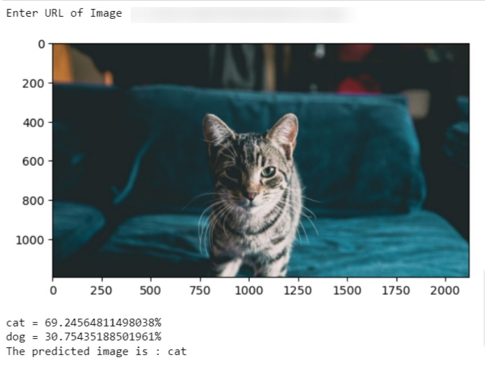
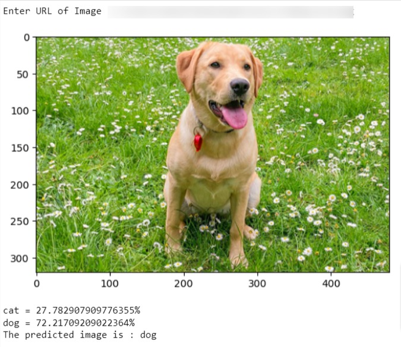

# Cat and Dog Recognition Machine Learning Project

This machine learning project is designed to classify images into two categories: cats and dogs.To classify images, here we are using SVM. Scikit-learn is a free software machine learning library for the Python programming language and Support vector machine(SVM) is subsumed under Scikit-learn
## Dataset
You can download the dataset used for this project from Kaggle. Here's the link to the dataset:

- [cats and dogs Kaggle Dataset]( https://www.kaggle.com/c/dogs-vs-cats/data)

To replicate this project, download the dataset and replace you dirctory path in code

## Final Result for Cat Image

## Final Result for Dog Image

